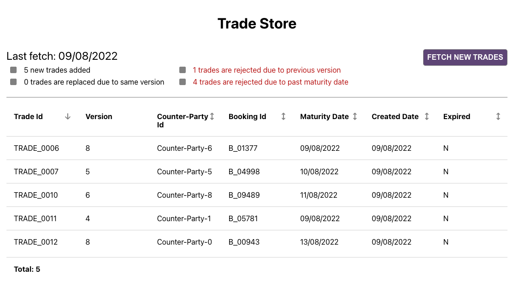
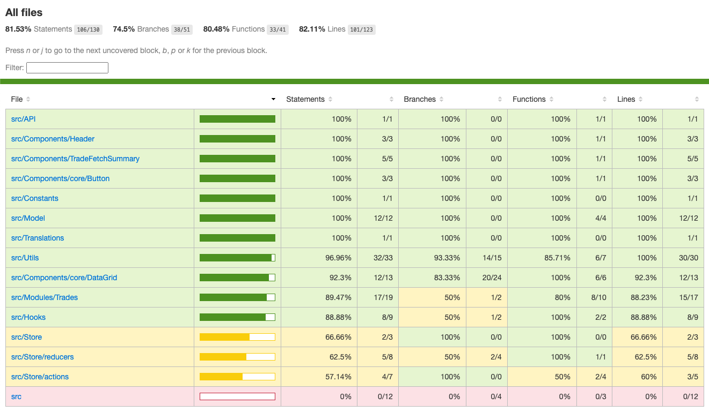
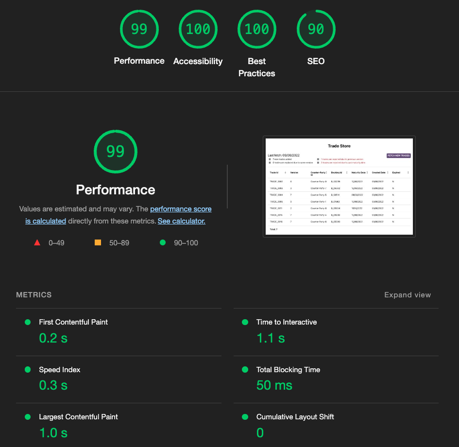

# Trade Store Application



# Running Application in local

1. Start `JSON-SERVER`
```
npm run json-server
```
2. Start application
```
npm start
```
3. Open [http://localhost:3000](http://localhost:3000) to view it in your browser.

# Using the Application

- On initial load, application fetches first set of trades and displays in grid.
- On click of `FETCH NEW TRADES` a new set of trades gets fetched and added to store.
- While merging, each new trade is validated against below constraints and necessary actions are taken
    1. If lower version is received, it will be rejected.
    2. If version is same, it will override the existing record.
    3. If maturity date is prior to today, it will be rejected.
    4. If a newer version or a completely new trade, it will be added.
- Store automatically updates expiry of all trades in store.
- After each fetch, fetch summary is displayed reflecting all rejections/additions.

# Available Scripts

In the project directory, you can run:

## `npm run json-server`

Start `JSON-SERVER`. This will host the required apis for the app @ [http://localhost:3001](http://localhost:3001)
## `npm start`

Runs the app in the development mode.\
Open [http://localhost:3000](http://localhost:3000) to view it in your browser.

## `npm test`

Launches the test runner in the interactive watch mode.\
See the section about [running tests](https://facebook.github.io/create-react-app/docs/running-tests) for more information.

## `npm run code-coverage`
Generate code coverage for the application

## `npm run build`

Builds the app for production to the `build` folder.

# Unit Test Coverage

This application have more then 80% of unit test coverage



# Light House report



